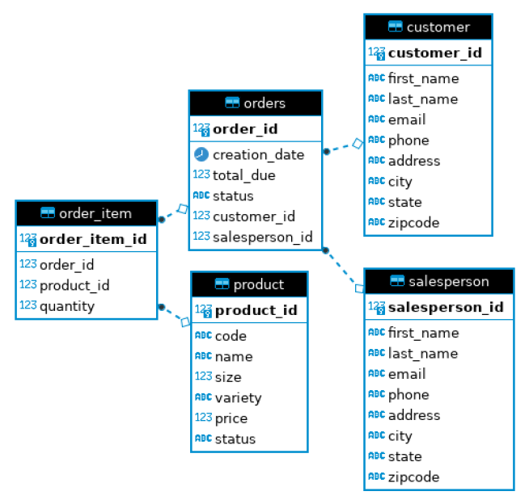

# Introduction
In this project I built an application using the Java Database Connectivity (JDBC) API to 
connect to a database and run queries to access the data. The app provides a tool for 
performing CRUD (Create, Read, Update, Delete) operations on the data within the database.
The project build was managed using Maven, and the Postgres database runs within a Docker 
container.

# Implementation
This project consists of various classes and interfaces, summarized below:
- DataTransferObject: Interface including the `getId()` method
- DataAccessObject: Extends DataTransferObject, implements all main CRUD operations
- Customer: Implements DataTransferObject, constructs customer object with data from database
- CustomerDAO: Extends DataAccessObject, contains SQL statements for all CRUD operations
- Order: Implements DataTransferObject, constructs customer object with data from database
- OrderLine: Constructs the OrderLine object containing all information regarding an order
- OrderDAO: Extends DataAccessObject, contains a SQL query to join tables to display relevant order, customer, product, and salesperson data

## ER Diagram
The database Entity-Relationship Diagram below shows the structure of the sample data used
to implement this project, as well as how the different tables are related to one another.

## Design Patterns
There are two standard design patterns when accessing a database using JDBC. The first is the
data access object (DAO) which I used in this project, and the second is the repository
design pattern. 

### Data Access Object
The DAO pattern is an abstraction of data persistence similar to the table-oriented structure
of the underlying database. There is often one DAO per table, which makes performing CRUD
operations straightforward.

### Repository
The repository pattern is less similar to the database, and instead acts as a mediator between
the domain and data using a collection-like interface.

# Test
How you test your app against the database? (e.g. database setup, test data set up, query result)
A test database called `hplussport` was created inside a Docker container using pre-made
SQL scripts to create tables and insert sample data. This database was used to test all of
the CRUD operations, executed using the `JDBCExecutor` main class. After running this method,
the database was manually checked in the terminal to confirm the CRUD operation was completed
successfully.