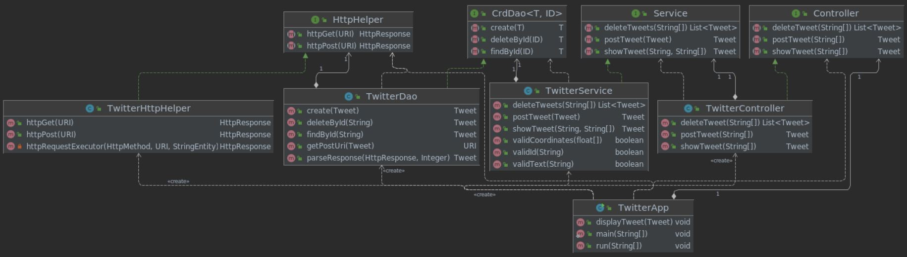

# Introduction
This app allows users interact with Twitter through the command line. It provides
the funcionality to post, view, and delete Tweets by creating and sending HTTP
requests via Twitter's REST API. The HTTP requests were sent using the Apache
`httpclient` package, and authorized using OAuth. The project follows MVC
architecture, and due to the many interconnected component layers the build was
simplified using Spring Boot. The build was managed using Maven, tested using
JUnit and Mockito, and deployed using Docker.

# Quick Start
- Clean, compile, and package using Maven:

      mvn clean package -DskipTests
- Export Keys and Secrets:

      export consumerKey="CONSUMER_KEY_VALUE"
      export consumerSecret="CONSUMER_SECRET_VALUE"
      export accessToken="ACCESS_TOKEN_VALUE"
      export tokenSecret="TOKEN_SECRET_VALUE"
- Run using .jar file:

      java -jar /path/file.jar post|show|delete [OPTIONS]
- Run using Docker:

      docker run --rm \
      -e consumerKey=YOUR_VALUE \
      -e consumerSecret=YOURVALUE \
      -e accessToken=YOUR_VALUE \
      -e tokenSecret=YOUR_VALUE \
      mitchellacton/twitter post|show|delete [OPTIONS]
- Specific Usage:

      post "tweet text" "lattitude:longitude"
      show "tweet_id" "id, text, favorite_count, etc"
      delete "tweet_id_1, tweet_id_2, ..., tweet_id_n"    
      

# Design
Created following the MVC architecture, without the view functionality. A
model was created to define the data structure, and a controller was implemented
to handle the HTTP requests and business logic. A detailed diagram of the design
is shown below.
## UML diagram

### Application
The top layer is the TwitterApp component. It is responsible for parsing the
arguments passed by the user, passing the specified command down to the controller
layer, and displaying the posted/shown/deleted tweet(s) as a JSON string.
### Controller
This layer first makes sure that the passed arguments are properly formatted. It
then parses the fields, tweet IDs, and coordinates. It then passes the arguments
to the service layer, first building the tweet object in the case of the `post`
command.
### Service
The business logic is handled in the service layer. The service layer ensures 
that the text doesn't exceed 140 characters, the passed coordinates are within
geographical limits, and that the tweet ID is an unsigned 64-bit integer. If
all parameters are legal, the command is passed to the DAO layer.
### DAO
The DAO layer creates a URI to be passed to the HTTP Helper. It requests and 
receives responses via the Twitter REST API, and parses the response into a JSON
string.
### HTTP Helper
This layer handles sending/receiving HTTP client requests/responses. Requests
are authorized using OAuth.
## Models
This project uses a simplified model of the Tweet object. The Tweet object is 
made up as fields such as ID, text, coordinates, favourite_count, and 
user_mentions. The model consists of the Tweet object itself, as well as
additional objects including Coordinates, Entities, UserMention, and Hashtag. 
## Spring
Due to the many dependencies, using a `main` method to run the app becomes less
practical. By simply applying annotations such as @Component, @Service, 
@Controller, and @Repository to the components, Spring can be used to handle
the dependencies and relationships automatically. 

# Test
The components of the app were tested using both JUnit4 and Mockito. JUnit was
used for integration testing, and Mockito was used to create mock objects to
test classes without needing their dependencies.

## Deployment
The app was packaged into a `.jar` file using Maven and pushed to a docker image
which can be accessed by pulling `mitchellacton/twitter`. A Dockerfile was 
created to mount the image and copy the `.jar` file.

# Improvements
- Include more Twitter functionality such as following and unfollowing users, 
direct messaging, and favouriting/retweeting
- Display specified number of tweets from Twitter feed without the need for tweet
ID
- Provide a simple GUI to make the app more user-friendly