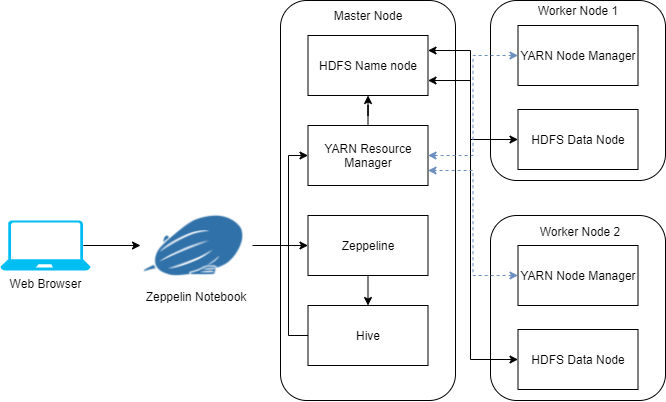

Table of contents
* [Introduction](#Introduction)
* [Hadoop Cluster](#Introduction)
* [Hive Project](#Introduction)
* [Improvements](#Introduction)

# Introduction
The purpose of this project is to provide a method for analyzing large
volumes of financial trade data. Due to the large size of the dataset, I
provisioned a Hadoop cluster using GCP DataProc to allow for distributed
processing of the data. The cluster consists of 1 master node and 2 worker
nodes, and operates using Big Data tools such as YARN, Hive, and MapReduce.

The financial data was exported from Google BigQuery to Google Storage, and
from there was copied to the cluster's distributed file system. Queries were
written using HiveQL to easily execute MapReduce jobs, and the data was optimized
by partitioning and storing as a Parquet file.

# Hadoop Cluster
### Cluster Architecture

### Cluster Hardware
- Master Node x 1: 2 CPU cores, 12GB RAM, 100GB Storage
- Worker Node x 2: 2 CPU cores, 12GB RAM, 100GB Storage

### Big Data Tools
#### HDFS
#### YARN
#### MapReduce
#### Hive
- hive server
- metastore
- rdbms
#### Zeppelin
    - HDFS, YARN, Zeppelin, Hive (hive Server, hive metastore, RDBMS), etc.
- Big data tools you evaluated (e.g. MapReduce, YARN, HDFS, Hive, Zeppelin, etc..)
- hardware specifications

# Hive Project
- Discuss how you optimized Hive queries? (e.g. partitions, columnar, etc..)
- Post your Zeppelin Notebook screenshot here
    - Make sure your Notebook is nice and clean as hiring managers will visit your project
    - use `Full Page Screen Capture` chrome extension to capture a webpage as a picture

# Improvements
- at least three improvements