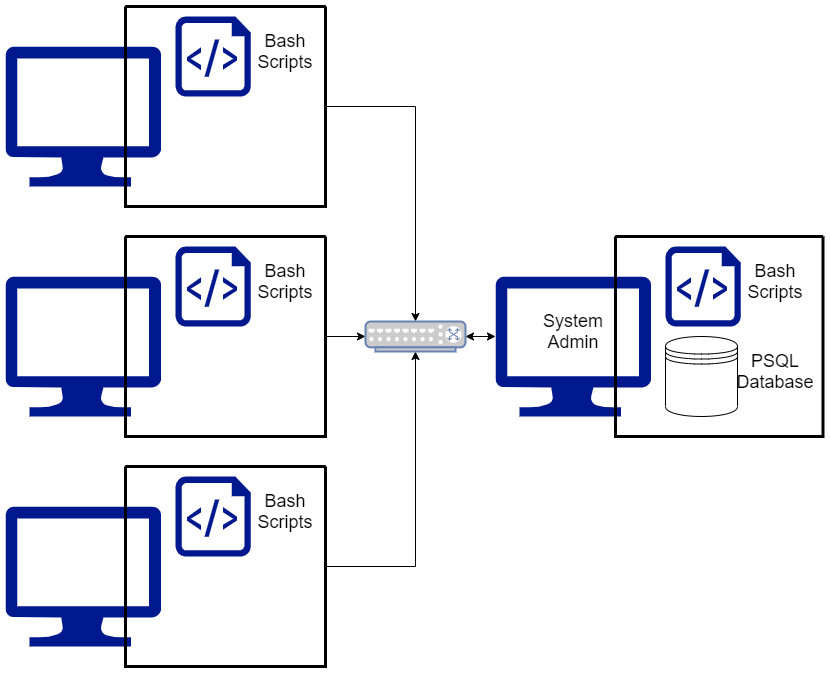

# Linux Cluster Monitoring Agent

This Linux Cluster Monitoring Agent is a hardware resource management 
product for Linux system clusters. Information regarding system hardware 
and host resource usage is collected and stored in a PostgreSQL Docker 
instance. Bash scripts are used to automatically populate the database with 
information from each host in the network. The data is queried to determine
average resource usage over time, as well as to detect any server failures.

This product is intended to be used by a linux cluster administration team,
to provide them with real time usage data and hardware specifications, so
that they may gain a better understanding of their system and have a powerful
tool for future resource planning.
# Quick Start

- Start a psql instance using psql_docker.sh

      $ ./scripts/psql_docker.sh start|stop|create [db_username][db_password]

- Create tables using ddl.sql

      $ psql -h <hostname> -U <PSQL User> -d <db name> -f .sql/ddl.sql

- Insert hardware specs data into the DB using host_info.sh

      $ ./scripts/host_info.sh psql_host psql_port db_name psql_user psql_password

- Insert hardware usage data into the DB using host_usage.sh

      $ ./scripts/host_usage.sh psql_host psql_port db_name psql_user psql_password

- Crontab setup

      $ crontab -e
      * * * * * bash ./scipts/host_usage.sh psql_host psql_port db_name psql_user psql_password > /tmp/host_usage.log

- Sample Database PSQL queries found in sql/queries.sql

# Implemenation
The Linux cluster consists of individual hosts running CentOS 7, connected
through a switching hub using internal IPv4 addresses. To use this
monitoring agent, the system administrator must set up a docker container,
PSQL database, tables to store the data, and run bash scripts to populate
the tables.

To start, the `psql_docker.sh` creates a PostgreSQL docker container 
using the `create [db_name][db_password]` argument, and the 
container can be started and stopped using the `start|stop` arguments.
At this point the `ddl.sql` script can be run to create the database and
tables needed to record hardware specifications and usage data. To populate
the tables, the `host_info.sh` script should be run once on each host to record
hardware data, and the `host_usage.sh` script should be run at regular 
intervals using crontab to record usage data in real time. The data can be
queried using sample queries found in `queries.sql`, or with any other
queries the system administrator may find useful.

## Architecture

## Scripts

###psql_docker.sh
    # Used to create a new PSQL docker instance with given username and password
    $ ./scripts/psql_docker.sh create db_username db_password
    # Used to start docker container
    $ ./scripts/psql_docker.sh start
    # Used to stop docker container
    $ ./scripts/psql_docker.sh stop
###ddl.sql
    # Used to create PSQL database and tables
    $ psql -h <hostname> -U <PSQL User> -d <db name> -f .sql/ddl.sql

    # Creates tables host_info and host_usage
    
###host_info.sh
    # Used to populate host_info table with system hardware information
    $ ./scripts/host_info.sh psql_host psql_port db_name psql_user psql_password

###host_usage.sh
    # Used to populate host_usage table with system resource usage data
    $ ./scripts/host_usage.sh psql_host psql_port db_name psql_user psql_password
###crontab
Automatically runs `host_usage.sh` every minute to store real time usage data in 
hosts_usage
###queries.sql
Three sample SQL queries, each intended to solve a practical business problem:
1. View hosts in descending order of total system memory, grouped with hosts having
equal numbers of CPU cores
2. View the average system memory usage of each system over 5 minute intervals
3. Detect and record any time the server goes down
## Database Modeling
There are two tables in the PSQL database, their schema are outlined below
- `host_info`
 
  | Column           | Data type     | Description  |
  | -------------    |:-------------| -----|
  | id               | SERIAL        | PK identifying host system|
  | hostname         | VARCHAR       |   Name of host system |
  | cpu_number       | INTEGER       |    Number of CPUs in system|
  | cpu_architecture | VARCHAR       |    System CPU architecture|
  | cpu_model        | VARCHAR       |    Model of CPU |
  | cpu_mhz          | FLOAT         |    CPU clock speed (MHz) |
  | l2_cache         | INTEGER       |    Size of L2 cache (MB)|
  | total_mem        | INTEGER       |    Total system memory (MB)|
  | timestamp        | TIMESTAMP     |    Timestamp of data (UTC) |

- `host_usage`

  | Column           | Data type     | Description  |
  | -------------    |:-------------| -----|
  | timestamp        | TIMESTAMP     | Timestamp of data in UTC time |
  | host_id          | INTEGER       | FK identifying host system|
  | memory_free      | INTEGER       | System memory not in use (MB)|
  | cpu_idle         | FLOAT         | System CPU not in use (%)|
  | cpu_kernel       | FLOAT         | System CPU Kernel in use (%) |
  | disk_io          | INTEGER       | Number of disk I/O |
  | disk_available   | INTEGER       | Remaining disk storage (MB) |
 
  

# Test
Bash scripts were all tested in the Linux command line. The results were
verified by checking command exit codes, docker container status, and data
in the PSQL tables. SQL queries were tested by using them against real and sample
system data.

# Improvements
Write at least three things you want to improve
e.g.
1. Updates for `host_info` table

     A script to update host hardware values, or remove a host from the database
     altogether would likely be useful for long term application use. Currently,
     this can be done using DDL, but a simple script would be more convenient.
2. More data columns for `host_usage`

     Additional entries such as network usage, power usage, and cpu temperature
     could be found useful by many system administrators.
3. Additional Queries

     Queries to record times when CPU or memory usage exceeds a certain threshold

