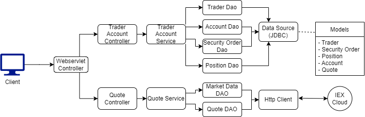

Table of contents
* [Introduction](#Introduction)
* [Quick Start](#Quick Start)
* [Implementation](#Implementation)
* [Testing](#Testing)
* [Deployment](#Deployment)
* [Improvements](#Improvements)

# Introduction
This project intends to replace the monolithic trading platform, which is difficult to scale and maintain.
The new system is built using microservice architecture with the Springboot framework.
The application is capable of requesting stock data from the IEX cloud for storage in a PSQL database. The 
program can also manage and store client and account details, and execute security orders. The build was
managed using maven, testing was performed using JUnit4, and the program was deployed using Docker.

# Quick Start
- Prerequisites: Docker, CentOS 7
- Set up Docker
    - build images
  
          cd ./springboot/
          docker build -t trading-app .
          docker image ls -f reference=trading-app
    - create a docker network
  
          sudo docker network create trading-net
    - start containers
  
           docker run --name trading-psql-dev \
          -e POSTGRES_PASSWORD=password \
          -e POSTGRES_DB=jrvstrading \
          -e POSTGRES_USER=postgres \
          --network trading-net \
          -v pgdata-trading:/var/lib/postgresql/data \
          -d -p 5432:5432 trading-psl

# Implementation
## Architecture

### Controller layer
The controllers receive requests from the client and pass these on to the service layer 
### Service layer
Ensures that the requests adhere to the business logic before being processed
### DAO Layer
Interact with the database or IEX cloud to execute the client's requests 
### SpringBoot
manage the dependencies and relationships between the different components of the application
### PSQL and IEX
Market data is retrieved from IEX Cloud and stored in a PSQL database along with other client information

## REST API Usage
### Swagger
Swagger is a web UI allowing clients to interact with the application in a much more user-friendly way
### Quote Controller
- Endpoints allow pulling data from IEX Cloud, and storing on a PSQL database

- GET /dailyList: Lists all the quotes on your daily list that are available to be traded
- GET /iex/ticker/{ticker}: show information of the given stock
- PUT /quote/iexMarketData: update stock information for all the quotes in your daily list
- PUT /quote: save a quote to your daily list
- POST /tickerId/{tickerId}: get information of the given stock from IEX and save it to your daily list
### Trader Controller
The trader controller is used to create and modify trader accounts

- POST /trader/: create a trader profile
- POST /trader/firstname/{firstname}/lastname/{lastname}/dob/{dob}/country/{country}/email/{email}: Create trader profile with given parameters
- PUT /trader/deposit/traderId/{traderId}/amount/{amount}: deposit funds to an account
- PUT /trader/withdraw/traderId/{traderId}/amount/{amount}: withdraw funds from an account
- DELETE /trader/traderId/{traderId}: delete a trader profile from the system

# Testing
Java classes were tested using JUnit 4. The DAO and Service classes were tested, resulting in a code coverage
of 70%.

# Deployment
- The trading app and database were built as docker images, and uploaded to dockerhub

      docker pull mitchellacton/trading-psql
      docker pull mitchellacton/trading-app

# Improvements
- Implement Order controller and Dashboard controller
- Implement a way for traders to place limit orders
- Provide more graphical features like charts